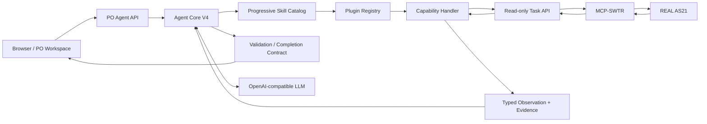

# PO Agent Harness — Architecture

## 1. Design goal

PO Agent is a governed enterprise agent for product-owner workflows over REAL AS21.

The design separates:

1. **reasoning** — the LLM decides what it needs to do;
2. **execution** — only allow-listed typed capabilities can run;
3. **truth** — factual answers must come from REAL AS21 / configured authoritative sources;
4. **presentation** — UI renders typed result states rather than inventing business meaning.

The core principle is:

> The model may be flexible in planning, but execution and factual authority are constrained.

## 2. High-level application architecture



The LLM does not query AS21 directly and is not treated as a business-data source.

## 3. Agent Core V4

The stable V4 loop is conceptually:

```text
user query
  -> compact skill discovery
  -> load selected skill contract
  -> planner decision
  -> governed capability call
  -> typed observation
  -> re-plan if needed
  -> completion validation
  -> grounded answer
```

The Core is deliberately domain-agnostic. Product logic should live in plugins/capability handlers, not in Core routing.

### Core responsibilities

- bounded plan/act/observe loop;
- typed decisions;
- skill loading;
- capability allow-list enforcement;
- session isolation;
- evidence collection;
- completion/postcondition enforcement;
- fail-closed behavior;
- traceability.

### Core must not contain

- hard-coded employee names;
- product-specific spaces;
- phrase-specific routes;
- business facts;
- arbitrary source endpoints;
- direct credentials.

## 4. Skills and capabilities

A **Skill** is procedural guidance: how to solve a class of requests.

A **Capability** is a governed executable operation.

A plugin typically contributes:

```text
SkillSpec
CapabilitySpec
CapabilityHandler
CompletionContract
UIContract
```

This is the primary extension surface. Adding a product capability should normally require no Agent Core changes.

Example:

```text
"Задачи Иванова за последние 2 дня"
    |
    +-> task.search_created Skill
          |
          +-> task.search_created Capability
                |
                +-> resolve person from configured/live identity
                +-> bounded REAL AS21 task read
                +-> source-backed created_at filter
                +-> exact task keys + Evidence
```

## 5. Product-space configuration

Product spaces are deployment data, not Core constants.

`task-api/config/products.yaml`:

```yaml
products:
  PAY:
    display_name: "Payments"
    aliases: ["PAY", "Payments"]
  CRM:
    display_name: "CRM"
    aliases: ["CRM"]
```

At Agent startup the configured product keys become the approved product-space set.

## 6. Team / competencies

`task-api/config/team_members.yaml` defines the canonical configured team directory.

A member can include:

- source identity/login;
- display name;
- product membership;
- role;
- professional profile;
- competencies.

Configured competencies are not source facts about task status and are not used to replace REAL AS21 task evidence. They are an explicit deployment-owned profile source for team/competency skills.

## 7. Source path

Production factual flow:

```text
Agent Core
  -> plugin capability
  -> Task API read facade
  -> MCP-SWTR
  -> REAL AS21
```

Task API is intentionally a facade because it:

- normalizes MCP transport details;
- provides bounded reads;
- converts transport/source failures into typed failures;
- keeps credentials out of Agent responses;
- prevents frontend components from calling AS21 directly.

## 8. Fail-closed model

A missing source is different from an empty result.

```text
REAL_EMPTY
  = source was successfully queried and proved zero matching entities

SOURCE_UNAVAILABLE
  = source could not prove the answer
```

The application must never render SOURCE_UNAVAILABLE as business count `0`.

This is especially important for analytics such as sprint predictability or release forecast where AS21 may not expose the required historical baseline/linkage.

## 9. UI architecture

The frontend uses typed Agent responses and page snapshots.

Main workspaces:

- Overview;
- Tasks;
- Sprints;
- Releases;
- Team;
- Quality;
- persistent Agent drawer.

The Tasks page sends the same raw natural-language query to Agent Core as the direct Agent chat. It does not contain a second client-side search engine.

Product chips/brand/default sprint/release are deployment configuration via Vite environment variables.

## 10. Security boundary

The community distribution is read-only by default.

```text
Frontend
   X no direct AS21
Agent
   X no arbitrary endpoint
Capability Registry
   -> approved read-only Task API
Task API
   -> approved MCP-SWTR tools
AS21
```

Secrets exist only in process environment/local ignored `.env` files.

## 11. Comparison with open agent frameworks

The architecture borrows the useful agentic idea of **plan -> act -> observe -> re-plan**, but applies an enterprise governance boundary:

- no arbitrary generated Python as normal execution;
- no arbitrary tool discovery outside the registry;
- no LLM-generated business facts;
- no silent local fallback when REAL AS21 fails;
- independent evidence/trace for executed capabilities.

In short: flexible reasoning, constrained execution.

## 12. Extension policy

Preferred order for new functionality:

1. plugin Skill/Capability;
2. capability handler;
3. Task API bounded read;
4. UI contract/rendering;
5. metadata/procedure improvements.

Changing Agent Core/planner/runtime/session semantics is exceptional and should require a reproducible platform-level defect that cannot be solved through extension seams.

## 13. Future architecture

### Learning Reviewer 2.0

Planned as an isolated reviewer, not self-modifying runtime:

```text
answer/trajectory
 -> feedback or validation failure
 -> independent reviewer
 -> authoritative source recheck
 -> first failing boundary
 -> generalized skill/policy candidate
 -> replay/sandbox
 -> independent QA
 -> versioned promotion or rejection
 -> rollback
```

### Multi-agent / V5

Multi-agent orchestration is useful for genuinely independent complex analysis, not ordinary search.

Possible V5 pattern:

```text
Coordinator
  +-> Task/Risk worker
  +-> Sprint/Flow worker
  +-> Team/Capacity worker
  +-> Release worker
        |
        v
   typed shared ledger
        |
        v
      Verifier
        |
        v
     Synthesizer
```

Simple requests should remain single-agent to avoid latency and reliability cost.
